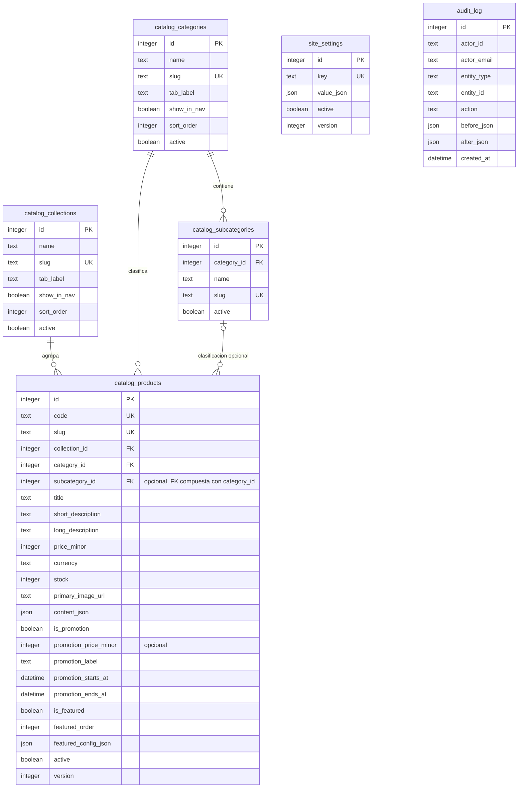

# Catálogo D1 simplificado

Implementación local. Una base D1, seis tablas activas; las diez tablas anteriores
se conservan **sin uso por la aplicación** como archivo temporal de la migración.
El prefijo `catalog_` permite introducir el nuevo modelo sin eliminar ni renombrar
datos anteriores. Los JSON originales tampoco se modifican.

## Diagrama entidad–relación del modelo activo



Las relaciones dibujadas son claves foráneas reales. La FK compuesta
`catalog_products(category_id, subcategory_id)` impide seleccionar una
subcategoría de otra categoría. Cada producto tiene una sola colección y categoría.
Una colección no depende de una categoría.

`site_settings` es configuración global, sin FK a productos. `audit_log` identifica
el registro por `entity_type + entity_id`: es una referencia lógica multientidad,
no una FK exclusiva a productos.

## Ciclo de vida

Las cuatro entidades de negocio y `site_settings` incluyen `active`, `created_at`,
`created_by`, `updated_at`, `updated_by`, `deactivated_at`, `deactivated_by`, `version`.
Las fechas nuevas se guardan en UTC. Las fechas de promoción se editan en hora local
y se envían con zona horaria.

No hay eliminación física desde la API ni el administrador. `DELETE` es también
una desactivación. Un registro inactivo conserva su ID y sus relaciones; los slugs
siguen reservados. El código y slug de producto son estables para conservar enlaces.

La visibilidad pública requiere producto, colección, categoría y subcategoría
(si existe) activos. Desactivar un catálogo no modifica el estado de sus productos.
Reactivarlo no reactiva productos que fueron desactivados individualmente.
Los productos incompletos se pueden guardar inactivos; para activarlos se requieren
imagen, descripciones y al menos una especificación, además de precio y clasificación.

Cada operación y su historial se ejecutan en un único `DB.batch`. La versión evita
sobrescribir ediciones simultáneas; la comprobación SQL dentro de la transacción
también revierte toda la operación si una versión cambió después de su lectura.
El historial es de solo anexado: no hay endpoints para editarlo o desactivarlo.

## Producto único y presentación

- La ficha y las tarjetas usan el mismo registro.
- Galería, especificaciones, dimensiones, opciones y contenido incluido se
  guardan en `content_json`, validado y editado con formularios (no JSON manual).
- Promoción y destacado son indicadores independientes. El precio promocional es
  opcional, debe ser menor al normal y solo se muestra durante su vigencia.
- `featured_config_json` contiene plantilla, ajustes y personalizaciones opcionales.
  Sin personalización se heredan nombre, etiqueta, descripción e imagen del producto.
  El botón a la ficha siempre se genera desde su código, nunca se copia un precio o enlace.
- Las plantillas, campos, opciones y valores predeterminados se definen una vez en
  `src/shared/product-config.js` y `src/shared/featured-config.js`. Formulario y servidor
  usan esas definiciones. La vista previa utiliza el mismo adaptador de datos y
  renderizador del destacado público.
- No se inyecta HTML arbitrario. Los textos se crean con nodos DOM; los tokens
  heredados de negritas/color se interpretan mediante una lista limitada.
- Las tabs salen de colecciones o categorías activas con `show_in_nav`. En modo
  categorías incluyen las subcategorías visibles; la categoría agrupa a sus hijos.
  “Todos” es una opción virtual. No existe una nueva tabla de tabs.

## Datos migrados y pendientes

Se migraron 12 productos, 4 colecciones y 1 categoría. No existían subcategorías.
Los tres banners anteriores apuntaban a colecciones, no a productos concretos:

- `shift-crew-01`
- `ghost-drop-01`
- `ghost-capsule-02`

Se conservan íntegros en el archivo original y en `site_settings` bajo
`legacy_featured`, junto con ajustes y datos originales. En **Destacados → Banners
anteriores pendientes de asociación**, seleccionar explícitamente su producto.
La asociación actualiza producto e historial de forma atómica; el banner pendiente
queda marcado con producto y fecha, sin borrarse. No sobrescribe una presentación
ya personalizada. El enlace pasa a la ficha del producto seleccionado.

Hasta que se asocien, estos banners no se publican ni se muestran como contenido
estático residual. No se inventaron asociaciones ni promociones para los productos.

Las tablas anteriores se mantienen declaradas en el esquema de Drizzle para que
las siguientes migraciones no las eliminen. Las migraciones aplicadas son inmutables.
Su futura retirada requeriría una decisión independiente y un archivo verificado.

## Administración y seguridad

Abrir `/admin` e iniciar sesión. El modo local y el de producción son distintos:

- En local, `.dev.vars` contiene `LOCAL_DEV_AUTH=true`. Esa identidad simulada
  solo existe en el proceso de Vite/Workers local y nunca se despliega.
- En producción, `LOCAL_DEV_AUTH=false`. Cloudflare Access entrega la identidad
  y el Worker permite únicamente los correos de `ADMIN_USER_EMAILS`.
  `ADMIN_USER_IDS` es opcional para permitir también sujetos estables de Access.

`ADMIN_USER_EMAILS` y `LOCAL_DEV_AUTH` son secretos requeridos por
`wrangler.jsonc`: un despliegue falla si faltan. En Cloudflare,
`LOCAL_DEV_AUTH` debe tener exactamente el valor `false`. Se administran en
**Workers & Pages →
sepia-chroma-street-2026 → Settings → Variables and Secrets**; no se guarda en
Git ni en `.dev.vars` de producción. La identidad local no es una autenticación
real de producción.

`site_settings` también conserva el marcador `migration_v2`. No es un catálogo
editable libremente: desde el administrador solo se modifica la clave `catalog`.
Los otros registros son soporte de migración y no se eliminan.

## Preparar y verificar en local

```sh
npm run db:setup:local
npm run dev
npm test
npm run build
```

`db:setup:local` exporta antes de migrar; `db:seed:local` respalda antes de importar.
Ambos usan exclusivamente `--local`. Los respaldos y SQL de importación quedan en
`.local-backups/`, ignorado por Git. El marcador evita repetir la carga y sobrescribir
ediciones del administrador. Si falla el respaldo o la clasificación es ambigua,
el script se detiene. La carga de datos es una transacción separada de la migración
de esquema.

Para ejecutar explícitamente una prueba con D1 local real:

```sh
node scripts/smoke-local.mjs http://127.0.0.1:5174
```

Esa prueba cambia temporalmente promoción, destacado y actividad de `ORBIT_01`;
restaura su contenido al terminar y conserva el historial de prueba. La validación
puede materializar valores predeterminados de la configuración visual.
Las pruebas de `npm test` usan SQLite en memoria y no modifican el catálogo local.

## Publicar sin desfasar D1

Antes de cada despliegue a producción, comprobar el esquema remoto:

```sh
npm run db:status:remote
```

Si aparecen migraciones pendientes, aplicar únicamente las migraciones versionadas
después de revisar el respaldo y el cambio:

```sh
npm run db:migrate:remote
```

Después se despliega el Worker. El código no aplica migraciones automáticamente:
esto evita modificar la base de producción como efecto secundario de un despliegue,
pero requiere seguir este orden. El comando remoto opera sobre D1; no ejecutar la
migración sin autorización para cambiar producción.

Verificaciones realizadas: compilación, pruebas automatizadas, API local, autenticación
simulada, escritura real con historial, promoción/destacado, desactivación/reactivación,
integridad de claves foráneas e importación repetida sin sobrescritura. No se realizó
una revisión visual interactiva del navegador ni un despliegue remoto.
